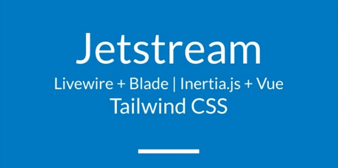
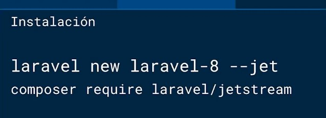

# LARAVEL 8 - JETSTREAM - LIVEWIRE 

## JETSTREAM

    

    JetStream proporciona la implementación de inicio de sesión, registro, 
    verificación de correo electrónico, autenticación de dos factores, 
    administración de sesiones, API a través de Lavavel Sanctacum y funciones 
    opcionales de administración de equipos.

    Jetstream esta basado en Tailwind CSS como framework CSS, además
    ofrece dos Stack(pilas) de FrontEnd: Livewire y Inertia.

## INSTALACIÓN

    

### LIVEWIRE
    Laravel Livewire es una biblioteca proporcionada por Laravel que simplifica
    la construcción de interfaces dinámicas, reactivas y modernas usando LARAVEL 
    BLADE con su lenguaje de plantillas y componentes.

## INERTIA
    La pila Inertia proporcionada por Jetstream usa VUE.js como lenguaje de plantillas
    y componentes, la creación de una aplicación con inercia es igual a la creación de 
    un aplicación con VUE solo que inercia utilizará el sistema de rutas de Laravel en 
    lugar del Enrutador de VUE
 